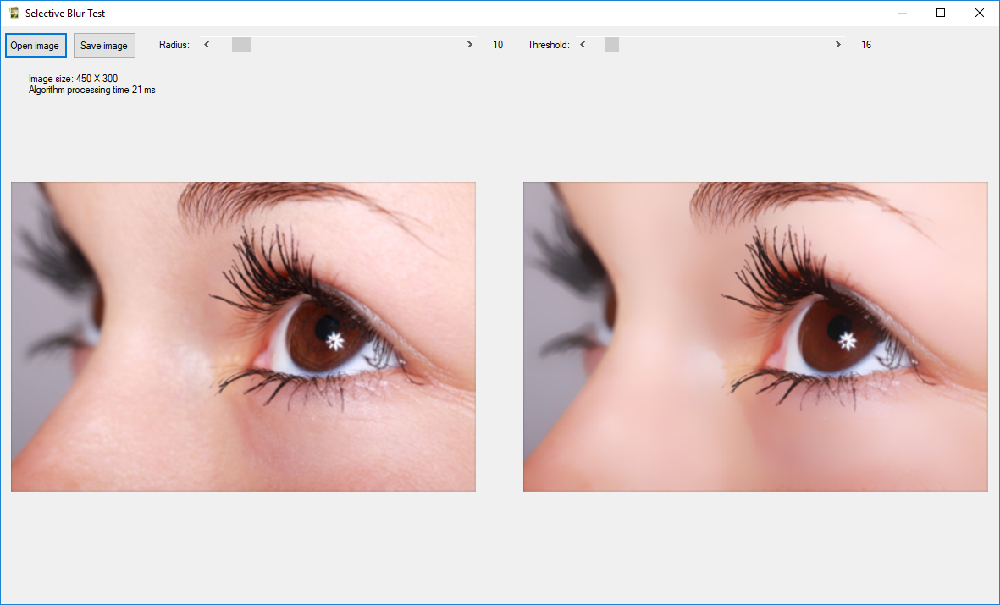

# Selective-Blur

This is a Selective Gaussian Blur that doesn't act on all pixels. The blur is applied only if the difference between its value and the
value of the surrounding pixels is less than a defined threshold value. So, contrasts are preserved because the difference is high on
contrast limits.

